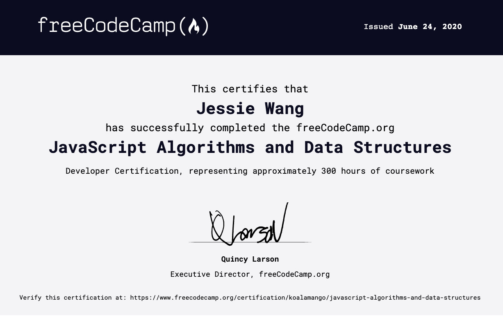

# FreeCodeCamp JavaScript | Algorithms and Data Structures

🏆 [Coding Challenge](https://www.freecodecamp.org/learn/) 🏆

This course contains 300 points (aks challenges), includes:

* [Basic JavaScript (110)](https://www.freecodecamp.org/learn/javascript-algorithms-and-data-structures/basic-javascript/)
* [ES6 (31)](https://www.freecodecamp.org/learn/javascript-algorithms-and-data-structures/es6/)
* [Regular Expressions (33)](https://www.freecodecamp.org/learn/javascript-algorithms-and-data-structures/regular-expressions/)
* [Debugging (12)](https://www.freecodecamp.org/learn/javascript-algorithms-and-data-structures/debugging/)
* [Basic Data Structures (20)](https://www.freecodecamp.org/learn/javascript-algorithms-and-data-structures/basic-data-structures/)
* [Basic Algorithm Scripting (16)](https://www.freecodecamp.org/learn/javascript-algorithms-and-data-structures/basic-algorithm-scripting/)
* [Object Oriented Programming (26)](https://www.freecodecamp.org/learn/javascript-algorithms-and-data-structures/object-oriented-programming/)
* [Functional Programming (24)](https://www.freecodecamp.org/learn/javascript-algorithms-and-data-structures/functional-programming/)
* [Intermediate Algorithm Scripting (21)](https://www.freecodecamp.org/learn/javascript-algorithms-and-data-structures/intermediate-algorithm-scripting/)
* [JavaScript Algorithms and Data Structure Projects (5)](https://www.freecodecamp.org/learn/javascript-algorithms-and-data-structures/javascript-algorithms-and-data-structures-projects/)

